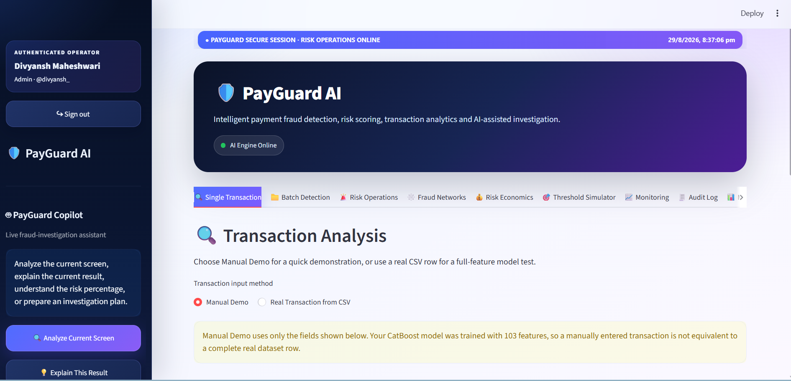

# 🛡️ PayGuard AI

### AI-Powered Payment Fraud Detection & Risk Operations Platform

PayGuard AI is an intelligent payment-risk platform designed to detect suspicious transactions, prioritize investigations, identify fraud relationships, and assist risk analysts with AI-powered investigation workflows.

Built for the **Razorpay AI Buildathon 2026 — AI Risk Manager Track**.

---
## 🖥️ PayGuard AI Dashboard



PayGuard AI provides a unified risk-operations dashboard for transaction scoring, fraud investigation, monitoring, network analysis, and AI-assisted decision support.
## 🚀 What PayGuard AI Does

Traditional fraud models often stop at predicting whether a transaction is fraudulent.

PayGuard AI extends fraud detection into a complete **AI Risk Operations workflow**:

**Transaction → Fraud Probability → Risk Classification → Decision → Investigation → Monitoring → Audit**

The system combines machine learning, risk policies, analytics, fraud-network intelligence, and an AI investigation copilot in one platform.

---

## ✨ Core Features

### 🔍 Real-Time Transaction Analysis
Analyze individual payment transactions and generate:

- Fraud probability
- Risk level
- Operational decision
- Transaction investigation context

### 📁 Batch Fraud Detection
Upload transaction datasets and perform large-scale fraud scoring with:

- Fraud probabilities
- Risk segmentation
- Decision classification
- Ground-truth evaluation

### 🛡️ Risk Operations
Prioritize suspicious transactions for analyst investigation and operational review.

### 🕸️ Fraud Network Analysis
Discover suspicious relationships and potential abuse rings across transaction entities.

### 💰 Risk Economics
Evaluate the operational impact of fraud decisions, including false-positive costs and investigation trade-offs.

### 🎯 Threshold Simulator
Explore how decision thresholds affect:

- Precision
- Recall
- False positives
- False negatives
- Operational workload

### 📈 Monitoring
Monitor fraud risk distributions, transaction activity, and operational signals.

### 📋 Audit Log
Maintain visibility into risk decisions and investigation activity for auditability.

### 🤖 PayGuard Copilot
AI-assisted fraud investigation powered by Gemini.

The Copilot can help analysts:

- Explain transaction risk
- Interpret fraud probabilities
- Investigate suspicious signals
- Generate investigation plans
- Analyze the current PayGuard screen

### 🔐 Secure Access
Authentication and local database-backed user access protect the risk dashboard from unauthorized use.

---

## 🧠 Machine Learning

PayGuard AI uses a **CatBoost classifier** trained for payment fraud detection.

The model processes **103 engineered transaction features**, including **53 categorical features**.

### Natural-Prevalence Evaluation

Evaluation dataset:

- **59,054 transactions**
- **2,213 fraudulent transactions**
- **56,841 legitimate transactions**
- **Fraud prevalence: 3.75%**

| Metric | Result |
|---|---:|
| ROC-AUC | 0.9191 |
| PR-AUC | 0.5249 |
| Precision | 43.24% |
| Recall | 58.43% |
| F1 Score | 49.70% |
| False Positive Rate | 2.99% |
| False Negative Rate | 41.57% |

The operational results are reported on a naturally imbalanced holdout rather than relying only on an artificially balanced fraud dataset.

---

## ⚖️ Risk Decision Policy

PayGuard converts model probabilities into operational actions.

| Fraud Probability | Decision |
|---|---|
| `< 0.60` | 🟢 ALLOW |
| `0.60 – <0.80` | 🟡 REVIEW |
| `0.80 – <0.90` | 🟠 VERIFY |
| `≥ 0.90` | 🔴 BLOCK |

Risk levels and operational decisions are treated as separate concepts.

---

## 🏗️ Architecture

```text
                    ┌───────────────────────┐
                    │   Transaction Data    │
                    └───────────┬───────────┘
                                │
                                ▼
                    ┌───────────────────────┐
                    │ Feature Engineering   │
                    └───────────┬───────────┘
                                │
                                ▼
                    ┌───────────────────────┐
                    │   CatBoost Model      │
                    │ Fraud Probability     │
                    └───────────┬───────────┘
                                │
                                ▼
                    ┌───────────────────────┐
                    │ Risk Decision Engine  │
                    └───────────┬───────────┘
                                │
                 ┌──────────────┼──────────────┐
                 ▼              ▼              ▼
              ALLOW          REVIEW         VERIFY/BLOCK
                                │
                                ▼
                    ┌───────────────────────┐
                    │ Risk Operations       │
                    │ Investigation Queue   │
                    └───────────┬───────────┘
                                │
                 ┌──────────────┼──────────────┐
                 ▼              ▼              ▼
          Fraud Networks   Risk Economics   Monitoring
                                │
                                ▼
                    ┌───────────────────────┐
                    │ Gemini AI Copilot     │
                    └───────────────────────┘
```

---

## 🛠️ Technology Stack

**Machine Learning**
- Python
- CatBoost
- Pandas
- NumPy
- Scikit-learn

**Application**
- Streamlit

**API**
- FastAPI
- Uvicorn

**AI**
- Google Gemini

**Data / Authentication**
- SQLite

**Visualization**
- Streamlit charts and interactive analytics

---

## 📂 Project Structure

```text
PayGuard-AI/
│
├── app.py
│
├── app/
│   ├── api.py
│   └── dashboard.py
│
├── src/
│   ├── predict.py
│   └── copilot.py
│
├── services/
│   └── risk_engine.py
│
├── models/
│   ├── payguard_model_config.json
│   └── payguard_preprocessing.joblib
│
├── notebooks/
│   ├── 01_eda.ipynb
│   └── 02_fraud_model.ipynb
│
├── scripts/
│
├── requirements.txt
├── .gitignore
└── README.md
```

---

## ⚙️ Local Setup

Clone the repository:

```bash
git clone https://github.com/divyanshmaheshwari617-cell/PayGuard-AI.git
cd PayGuard-AI
```

Create a virtual environment:

```bash
python -m venv .venv
```

Activate it on Windows:

```powershell
.\.venv\Scripts\Activate.ps1
```

Install dependencies:

```bash
pip install -r requirements.txt
```

---

## 🔑 Gemini Configuration

Create:

```text
.streamlit/secrets.toml
```

Configure your Gemini credentials locally.

**Never commit API keys or secrets to GitHub.**

The `.streamlit/secrets.toml` file is excluded through `.gitignore`.

---
## 📦 Model Setup

The trained CatBoost model file is not stored directly in this GitHub repository because it is larger than GitHub's normal per-file upload limit.

Expected local model path:

```text
models/payguard_fraud_catboost.cbm
## ▶️ Run PayGuard

Start the Streamlit dashboard:

```bash
streamlit run app.py
```

---

## 🔌 Run the Risk API

Start the FastAPI service:

```bash
python -m uvicorn api:app --app-dir app --host 127.0.0.1 --port 8000 --reload
```

---

## 🧪 Model Evaluation Philosophy

Fraud detection is an imbalanced classification problem.

For this reason, PayGuard does not rely on accuracy alone.

Evaluation focuses on:

- ROC-AUC
- PR-AUC
- Precision
- Recall
- F1
- False Positive Rate
- False Negative Rate
- Fraud prevalence
- Operational action rate

This makes the evaluation more representative of a real payment-risk environment.

---

## 🔒 Security

PayGuard follows several security principles:

- Secrets are excluded from Git
- API credentials are never hard-coded
- Authentication protects dashboard access
- Local authentication data is excluded from the repository
- Risk decisions can be recorded for auditability
- AI Copilot is designed for defensive fraud investigation

---

## 🎯 Buildathon Track

### Razorpay AI Buildathon 2026
### Track 02 — AI Risk Manager

PayGuard AI demonstrates how AI can support payment-risk teams beyond simple fraud classification by combining:

**Detection + Prioritization + Investigation + Network Intelligence + Decision Support + Monitoring + Auditability**

---

## ⚠️ Important Note

PayGuard AI is a prototype/buildathon project intended for fraud detection research and demonstration.

The machine-learning model was trained using the IEEE-CIS fraud detection dataset. Live payment systems may expose different features and distributions, so production deployment would require feature mapping, validation, monitoring, security review, and retraining/calibration using representative payment data.

---

## 👨‍💻 Author

**Divyansh Maheshwari**

Built for the Razorpay AI Buildathon 2026.

---

## ⭐ Project Vision

> PayGuard AI transforms a fraud probability into an actionable risk investigation workflow.

Instead of asking only:

**“Is this transaction fraudulent?”**

PayGuard helps a risk team answer:

**“How risky is it, what should we do, why does it matter, and what should an analyst investigate next?”**